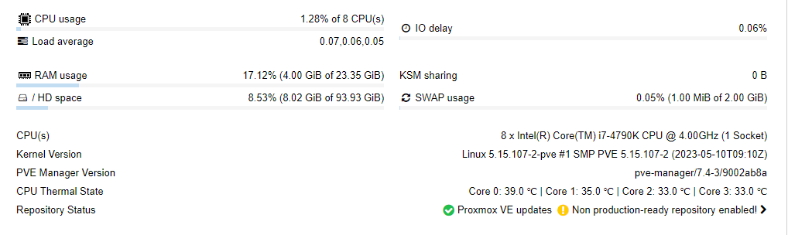

# Download the Proxmox VE 8.0 ISO 
# https://www.proxmox.com/en/downloads/category/iso-images-pve

# Create a bootable USB stick
# https://www.balena.io/etcher/

# Boot from the USB stick and install Proxmox VE
# https://pve.proxmox.com/wiki/Installation

# After the installation, you can access the web interface at https://<ip>:8006
# The default user name is "root" and the password is the one you set during the installation.

